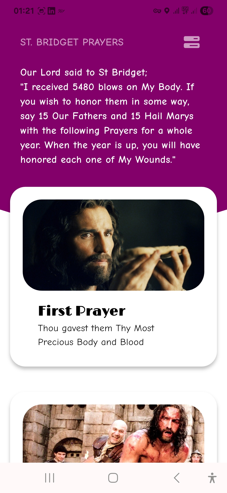

## Introduction
- 👀 I’m interested in Mobile Development
- 🌱 Forever a student of Android, IOS and Flutter Development

## Apps in Development
- LughaUcit  - A learning app to learn Croatian, as I learn from a croatian teacher.
- J-Fitness  -  A workout app with various workout programs and capability to add new workouts

## Apps in Testing
- Revela: Bible & Prayer - A spiritual app with Catholic prayers and various bible versions

## Languages

 

## The Most used Languages

## Revela Screenshots

    
  
   
   
   

<!---
briannaBrie/briannaBrie is a ✨ special ✨ repository because its `README.md` (this file) appears on your GitHub profile.
You can click the Preview link to take a look at your changes.
--->
